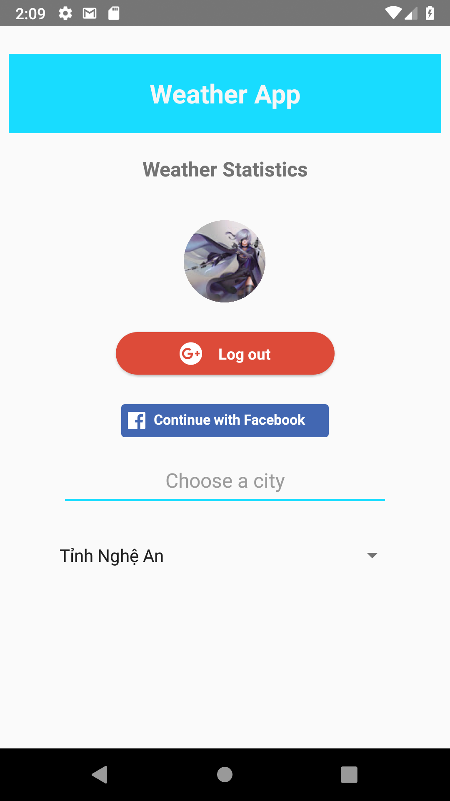

# Login APP using React Native [Android]

- [Firebase](https://firebase.google.com/)
- [Google-signin](https://github.com/react-native-community/react-native-google-signin)
- [FBSDK](https://github.com/facebook/react-native-fbsdk)

## Screenshot

## Installation

- Clone this project
- Run on terminal:
  - npm install #install package dependencies
- Open folder android on android studio, after build successful then run avd (tools -> avd)
- Run on terminal:
  - react-native run-android # load app into virtual device
  - react-native start #start sever js
